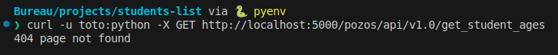
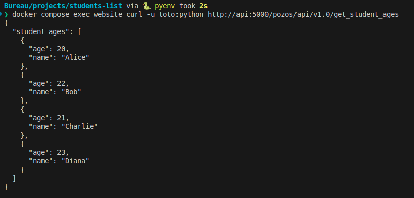
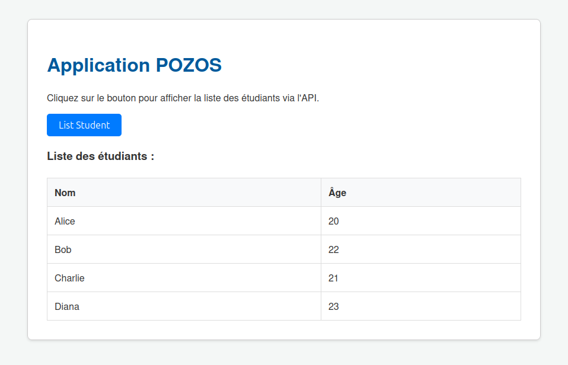
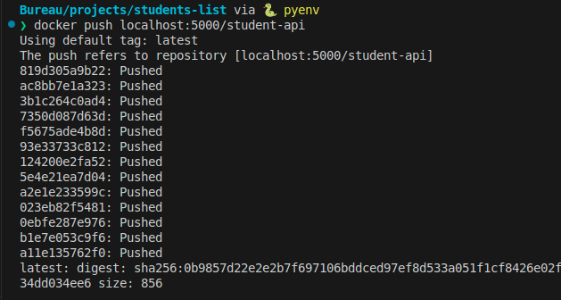
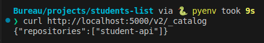

# Projet Docker : Déploiement de l'application "Student List"

## 1. Description du Projet

Ce projet met en œuvre une architecture microservices simple pour l'application "Student List". L'objectif est de conteneuriser et d'orchestrer un frontend en PHP et un backend API en Python/Flask à l'aide de Docker et Docker Compose. Ce projet simule un besoin d'entreprise visant à moderniser une infrastructure pour garantir la scalabilité et la facilité de déploiement.

## 2. Architecture de l'Application

L'application est composée de deux modules distincts, chacun tournant dans son propre conteneur:

* **API Backend** : Un service écrit en Python avec le framework Flask qui expose une API REST. Il renvoie une liste d'étudiants depuis un fichier JSON et requiert une authentification basique pour accéder aux données.
* **Frontend Web** : Une application web écrite en HTML et PHP qui permet aux utilisateurs finaux de visualiser la liste des étudiants. Elle interroge l'API pour récupérer les données et les affiche à l'écran.
* **Réseau** : Les deux services communiquent via un réseau Docker dédié pour une communication sécurisée et isolée, comme demandé dans la configuration `docker-compose.yml`.

## 3. Instructions de Lancement

Pour lancer l'application en local, veuillez suivre ces étapes :

1.  **Pré-requis** : Assurez-vous d'avoir Docker et Docker Compose installés sur votre machine.
2.  **Cloner le dépôt** :
    ```bash
    git clone [https://github.com/PommeSauce0/projet-docker-student-list.git](https://github.com/PommeSauce0/projet-docker-student-list.git)
    cd projet-docker-student-list

    ```
3.  **Lancer l'application** :
    Exécutez la commande suivante à la racine du projet. Elle construira l'image de l'API et démarrera les deux conteneurs.
    ```bash
    docker compose up --build -d
    ```
4.  **Accéder à l'application** :
    Ouvrez votre navigateur web et rendez-vous à l'adresse suivante :
    [**http://localhost:8080**](http://localhost:8080)


## 4. Captures d'Écran et Tests

Voici les captures d'écran prouvant le bon fonctionnement de chaque étape du projet, comme demandé dans l'énoncé.

### 1. Test de l'API avec `curl`

Pour valider le bon fonctionnement de l'API et la sécurité de l'architecture, deux tests ont été effectués.

#### a) Tentative d'accès direct (Échec attendu)

La première tentative consiste à appeler l'API directement depuis la machine hôte (`localhost`). Comme le service `api` n'expose pas son port publiquement dans le fichier `docker-compose.yml` (ce qui est une bonne pratique de sécurité), cette tentative échoue comme prévu. Cela démontre que notre backend est bien isolé du monde extérieur.

```bash
curl -u toto:python -X GET http://localhost:5000/pozos/api/v1.0/get_student_ages
```



#### b) Test d'accès interne (Succès)

La seconde méthode, qui est la bonne pratique, consiste à exécuter `curl` depuis un conteneur autorisé (`website`) qui se trouve sur le même réseau Docker. Cette fois, l'API est jointe avec succès via son nom de service (`api`), et elle renvoie les données JSON attendues, confirmant que la communication interne fonctionne parfaitement.

```bash
docker compose exec website curl -u toto:python http://api:5000/pozos/api/v1.0/get_student_ages
```




### 2. Résultat sur l'Interface Web

L'application est accessible via le navigateur et affiche la liste des étudiants après avoir cliqué sur le bouton "List Student".



### 3. Utilisation du Registre Docker Privé

L'image personnalisée `student-api` a été poussée avec succès vers un registre Docker privé lancé localement.



